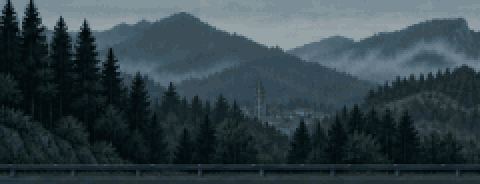

  

I make tools I want to use. Mostly terminals, media, and things that run on my own machine.

`Rust` · `Go` · `Java` · `Python` · `C` · `C++` · `TypeScript`  
`React` · `Spring Boot` · `PostgreSQL` · `MongoDB`  
`Linux` · `Docker` · `Neovim`

[projects](https://github.com/bilalyazicioglu?tab=repositories)

### Elsewhere

  
  
  

